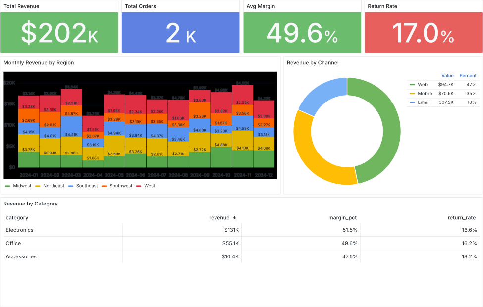
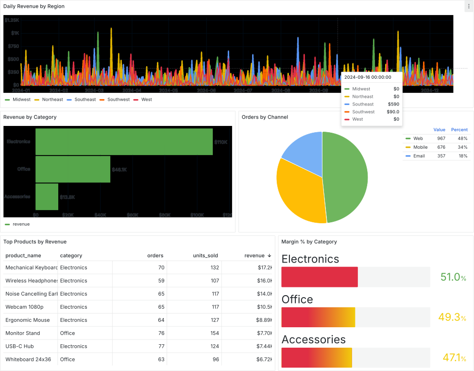

# Grafana + Keycloak + ClickHouse OAuth Demo

A working demonstration of JWT-based access control across three services. A token issued by Keycloak determines what data a user can query in ClickHouse and which dashboards they can see in Grafana — with no local user accounts needed in ClickHouse.

## Quick start

```bash
docker compose up
```

Grafana takes about 90 seconds to install the ClickHouse plugin. The `grafana-setup` container runs automatically once Grafana is ready and sets folder permissions. When `grafana-setup` exits, everything is ready. Go to http://localhost:3000.

## Users

| User  | Password | Keycloak groups                                   | ClickHouse access (token)  | Grafana role |
|-------|----------|---------------------------------------------------|----------------------------|--------------|
| amara | amara    | clickhouse-admins, grafana-admins                 | raw + analytics + reports  | Admin        |
| helen   | helen      | clickhouse-analysts, grafana-editors              | analytics + reports        | Editor       |
| mateo | mateo    | clickhouse-readers, grafana-viewers               | reports only               | Viewer       |
| demo  | demo     | clickhouse-admins, grafana-admins                 | raw + analytics + reports  | Admin        |
| priya  | priya     | clickhouse-analysts, grafana-editors (Keycloak)   | see below                  | Editor       |

### Priya — two identities

Priya exists in both ClickHouse and Keycloak. Their access depends on how they authenticate:

| Auth method | How | ClickHouse access |
|-------------|-----|-------------------|
| Password | `clickhouse-client --user priya --password priya` | reports only (`reader_role`) |
| JWT token | `clickhouse-client --jwt $TOKEN` | reports + analytics (`clickhouse_analysts`) |

Amara, Helen, and Mateo have no local ClickHouse accounts at all. ClickHouse trusts the JWT Keycloak issues and assigns roles from the `groups` claim automatically.

## What each user sees in Grafana

**Mateo (Viewer)** — *Executive Overview* only: monthly revenue by region, channel breakdown, category summary. Data from `reports.*` — pre-aggregated, no PII. The Executive Overview dashboard looks like this:



**Helen and Priya (Editor)** — *Executive Overview* and *Analytics Dashboard*: daily revenue time series, top products, margin by category, order volume trends. Data from `analytics.*` and `reports.*`. The Analytics dashboard looks like this: 



**Amara / demo (Admin)** — all three dashboards including the *Admin Dashboard*: raw order rows with customer names and emails, cost vs price analysis, daily order value by channel. Data from `raw.*`, `analytics.*`, and `reports.*`. The Admin dashboard looks like this: 


## How the access control works

```
Keycloak group         roles_transform (- → _)    ClickHouse role
─────────────────────  ──────────────────────────  ──────────────────────────────
clickhouse-readers  →  clickhouse_readers       →  SELECT on reports.*
clickhouse-analysts →  clickhouse_analysts      →  SELECT on reports.* + analytics.*
clickhouse-admins   →  clickhouse_admins        →  SELECT on reports.* + analytics.* + raw.*
```

The JWT Keycloak issues contains a `groups` claim. ClickHouse's token processor reads that claim, applies `roles_transform` to convert hyphens to underscores, and assigns the matching role. No local ClickHouse users are needed for token-authenticated users.

Grafana maps Keycloak groups to Grafana roles, which control dashboard visibility:

```
grafana-admins  → Admin  → sees all three dashboards
grafana-editors → Editor → sees public + analytics
(everyone else) → Viewer → sees public only
```

## Token demo

`token_demo.sh` shows the full access control matrix from the command line. It fetches tokens from Keycloak and runs queries via the containerized `clickhouse-client`:

```bash
bash token_demo.sh
```

The Priya section is the interesting part — it runs the same queries twice, once with
`--user priya --password priya` (reader access only) and once with `--jwt $TOKEN` (analyst access via Keycloak groups), showing that the same person gets different ClickHouse permissions depending on how they authenticate.

You can also query interactively using ClickHouse Play at http://localhost:8123/play. Log in as `priya`/`priya` to see their native password-auth access level (reports only).

## Resetting between demo runs

Log out without restarting:

```
http://localhost:3000/logout
http://localhost:8080/realms/grafana/protocol/openid-connect/logout
```

Full restart:
```bash
docker compose down && docker compose up
```

Folder permissions are reset on restart — `grafana-setup` re-applies them automatically.

Get a token for manual testing:

```bash
TOKEN=$(curl -s -X POST \
  http://localhost:8080/realms/grafana/protocol/openid-connect/token \
  -d "client_id=grafana-client&client_secret=grafana-secret&grant_type=password" \
  -d "username=amara&password=amara&scope=openid" \
  | jq -r .access_token)
```

At this time only the Altinity Antalya build of `clickhouse-client` supports the `--jwt` parameter. For that reason, we're running it via `docker exec` to make sure we're getting the right build: 

```bash
# Use it with clickhouse-client
docker compose exec clickhouse clickhouse-client \
  --jwt "$TOKEN" \
  --query "SELECT currentUser(), groupArray(role_name) FROM system.current_roles GROUP BY 1"

# Use it with the HTTP interface (same path Grafana uses)
curl -s "http://localhost:8123/?query=SELECT+currentUser()" \
  -H "Authorization: Bearer $TOKEN"
```

## Data

2,000 synthetic e-commerce orders dated 2024-01-01 to 2024-12-30, across 5 regions (Midwest, Northeast, Southeast, Southwest, West), 3 channels (web, mobile, email_campaign), 3 statuses (completed, returned, cancelled), and 3 product categories (Electronics, Office, Accessories).

Loaded on first container start from `orders_raw.csv` into:

- `raw.orders` — full rows including customer PII and unit cost data (admins only)
- `analytics.orders` — derived columns added: revenue, margin, margin_pct (analysts+)
- `reports.monthly_revenue` — aggregated by month / region / category (all users)
- `reports.product_performance` — one row per product (all users)
- `reports.channel_summary` — one row per channel (all users)
